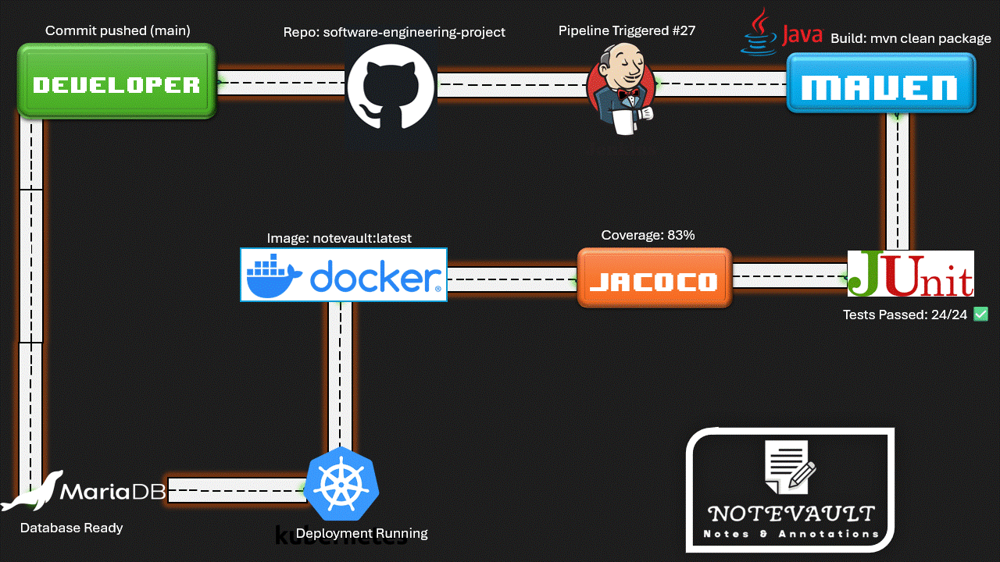

# NoteVault

**NoteVault** is a JavaFX desktop application for hierarchical note management, 
developed across **Software Engineering Project 1 (SEP1)** and continued in **Software Engineering Project 2 (SEP2)**.

While the application delivers secure and structured note management, 
the core focus of the project is the full software engineering lifecycle, 
emphasizing DevOps practices, quality assurance, and collaborative development.

The application supports multi-language localization using Java ResourceBundles, with user-selected language preferences.

---

## Project Evolution

**SEP1 Focus**

- DevOps lifecycle implementation
- CI/CD pipeline
- Image containerization
- Core application development

**SEP2 Focus (Ongoing)**

- Localization support (multi-language UI: Burmese, English, Finnish, Nepali, Sinhala)
- Advanced quality assurance (functional & non-functional testing)
- Improved documentation and maintainability
- Extended DevOps practices and test coverage
- Continued agile development using sprint cycles

---

## Features

- Hierarchical notebook & note management
- Secure authentication using BCrypt
- Responsive GUI using JavaFX background threads
- Automated CI/CD pipeline with Jenkins
- Containerized environment using Docker
- Localization support (introduced in SEP2)
- Kubernetes-based deployment (Minikube)
- Quality assurance

---

## Localization (language switch)

- Supported languages: English (default), Finnish, Nepali, Burmese, Sinhalese. Strings live in `src/main/resources/i18n/MessagesBundle*.properties`.
- How to switch at runtime:
  1. Launch the app (e.g., `mvn clean javafx:run` or run the packaged JAR).
  2. In the dashboard toolbar use the language dropdown (shows codes like EN/FI/NP/MY/SI) or open the language dialog ("Change language" action).
  3. Pick a language and confirm — UI text updates immediately and the choice is saved in user preferences for the next run.
- To add a new language: create `MessagesBundle_<lang>.properties`, fill all keys (use `MessagesBundle_en.properties` as the baseline), and register it in `LanguageModel` with a locale code.
- Essential localization resources: translation files in `src/main/resources/i18n/`, locale helper `util.Localization`, language registry `model.LanguageModel`, and the selection UI in `controller.ViewDashboardController` / `controller.LanguageDialogController`. Human translators or a lightweight localization tool (e.g., POEditor/Weblate) can manage the property files.

---

## Technologies Used

- **Frontend:** `JavaFX (FXML + SceneBuilder)`
- **Backend:** `Java 21`, `JPA/Hibernate`
- **Database:** `MariaDB`
- **DevOps:** `Docker`, `JaCoCo`, `JUnit`, `Jenkins`, `Kubernetes (Minikube)`, `Maven`
- **Quality Assurance:** `SonarQube`
- **Project Management:** `Git (feature branches)`, `Trello`

---

## Database Architecture

NoteVault uses a MariaDB database (`notevault_db`) to manage users, notebooks, notes, and tags.
The database is automatically initialized when the application runs; no manual setup is needed.

**Note on Database Credentials & Docker**
> The application uses environment variables for database credentials (`DB_HOST`, `DB_PORT`, `DB_NAME`, `DB_USER`, `DB_PASSWORD`).  
> For a ready-to-run setup, you can use Docker Compose — see [Related Files](Documents/Related_Files/setup-instructions.md) for detailed instructions.

- For full table details, visit [Database Documentation](Documents/Database/database-architecture.md)

- For modelling diagrams, visit [UML Diagrams](Documents/Diagrams/)

---

## DevOps Pipeline

> High-level overview of CI/CD, testing, and containerization stages.

---

## Team

Developed by a team of 4 students as part of:

**Software Engineering Project 1 & 2**

**Team members**

- Dinal Maha Vidanelage
- Sandip Ranjit
- Swostika Lama
- Twe He Gam Aung

---

## Useful Links

- **GitHub repository:** [software-engineering-project](https://github.com/SandipFromPokhara/software-engineering-project.git)

- **Trello workspace:** [SEP1_Team9](https://trello.com/w/sep1_team9/home)

- **Detailed DevOps process, project management:** [Related Files](Documents/Related_Files/)

- **Localization Documentation:** [Localization Details](Documents/Localization/localization.md)

- **Sprint reports and reviews:** [Sprint Documentations](Documents/Sprint_Reports/)